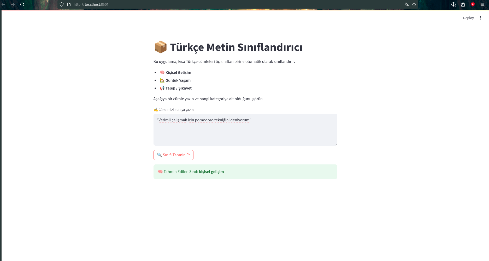

# 🇹🇷 Turkish Text Classifier with TF-IDF and Scikit-learn

A real-world Turkish text classification project using **TF-IDF**, **Naive Bayes**, and **GridSearchCV**, designed to classify short texts into three categories:
- 🧠 Personal Development (`kişisel gelişim`)
- 🏡 Daily Life (`günlük yaşam`)
- 📢 Complaint/Request (`talep/şikayet`)

---

## 🚀 Features

- ✅ Custom Turkish stopword list  
- ✅ TF-IDF vectorization with n-gram support  
- ✅ Model training with Naive Bayes, Logistic Regression, and Decision Tree  
- ✅ Automatic hyperparameter tuning using GridSearchCV  
- ✅ Model saving and loading using `.pkl` files  
- ✅ Ready for web interface integration with Streamlit  

---

## 🧠 Dataset

Handcrafted short Turkish sentences, labeled in 3 real-world categories.  
Dataset is included directly in `data.py` or inline in the notebook.

---

## 🛠 Installation

```bash
git clone https://github.com/username/turkish-text-classifier.git
cd turkish-text-classifier
pip install -r requirements.txt
## 📸 Uygulama Ekran Görüntüsü




